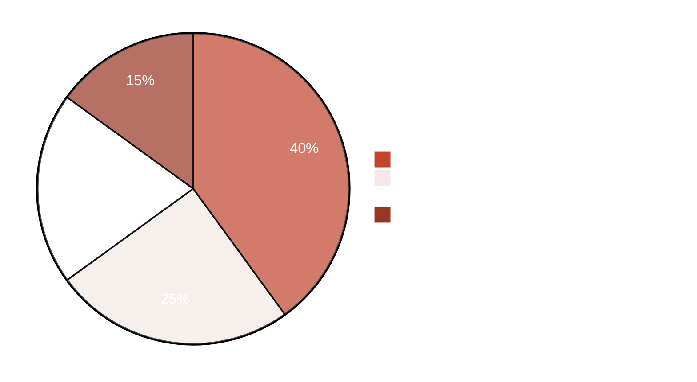
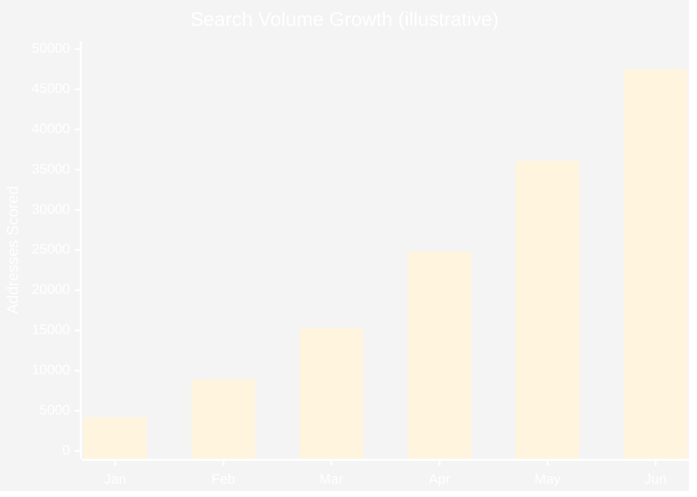
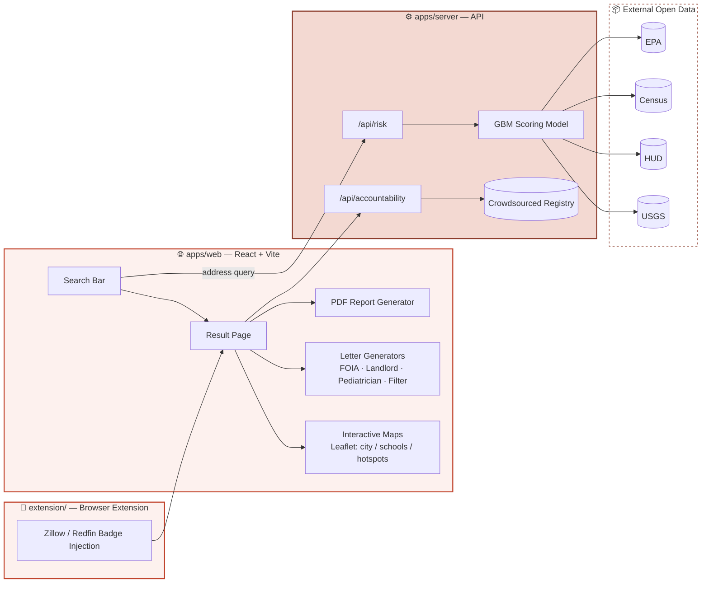

<div align="center">


<br/>

<p>
  
  
  
  
</p>

<p>
  
  
  
  
  
  
  
</p>

<br/>

<a href="#-live-demo">Live Demo</a> •
<a href="#-what-it-does">What It Does</a> •
<a href="#-architecture">Architecture</a> •
<a href="#-tech-stack">Tech Stack</a> •
<a href="#-getting-started">Getting Started</a> •
<a href="#-api">API</a> •
<a href="#-contributing">Contributing</a>

</div>

<br/>

<div align="center">

</div>

## 💧 What It Does

**Plumbum** tells anyone in the US whether their home's drinking water is at risk from lead pipes — in under 3 seconds, with zero sign-up.

Type an address. Get a personalized risk score, pipe-material heatmap, plain-English translation of your utility's Consumer Confidence Report, and ready-to-send FOIA/landlord/pediatrician letters — all generated instantly from public data.

<table>
<tr>
<td width="50%" valign="top">

### 🔴 The Problem
- Lead service lines poison an estimated **9+ million** US households
- Utility disclosures are buried in dense, jargon-heavy PDF reports
- Renters and buyers have almost no way to check *before* it matters
- Existing tools are paywalled, ad-choked, or don't exist for most cities

</td>
<td width="50%" valign="top">

### ✅ The Fix
- One search box. One number. One clear answer.
- ML risk model trained on EPA / Census / HUD / USGS open data
- Auto-generated advocacy documents — no legalese required
- 100% free, no login, no ads, no tracking — ever

</td>
</tr>
</table>

<br/>

## 📊 Risk Score, Visualized





<br/>

## 🗺️ Architecture



<br/>

## 🧭 Site Map

| Route | Purpose |
|---|---|
| `/` | Hero search, featured cities, state risk map, live accountability preview, API playground |
| `/result` | Full report — score ring, risk factors, heatmap, CCR translation, 6 action tabs, PDF export |
| `/listing-result` | Extension-driven result page for real-estate listing URLs |
| `/schools` | Lead risk for nearby schools & daycares, interactive map |
| `/hotspots` | Live city leaderboard by search volume & average risk |
| `/accountability` | Crowdsourced landlord compliance registry |
| `/city/:slug` | Neighborhood-level deep dive for a specific city |
| `/research` | Journalist tools — budget tracker, redlining correlation, FOIA & press-pitch generators |
| `/methodology` | How the GBM scoring model works |
| `/api-docs` | Live interactive API explorer |
| `/extension` | Browser extension install & dev guide |
| `/data` | Raw open dataset downloads |

<br/>

## ⚡ Key Capabilities

<div align="center">

| 🎯 Feature | Description |
|:---:|---|
| **Live Risk Scoring** | GBM model scores any US address in real time |
| **PDF Reports** | Branded, bilingual `jsPDF` reports, one click to download |
| **Document Generators** | FOIA request, landlord notice, pediatrician letter, free-filter demand |
| **Pregnancy Mode** | Elevated warnings surfaced site-wide when toggled on |
| **Crowdsource DB** | Community-submitted pipe material & water test verification |
| **Browser Extension** | Injects risk badges directly onto Zillow / Redfin listings |
| **EN / ES Bilingual** | Full parity across every page and generated document |

</div>

<br/>

## 🛠️ Tech Stack

<div align="center">


</div>

```
Frontend   → React 18 · TypeScript · Vite · CSS Modules · Leaflet
Backend    → Node · Express-style routes · Supabase (Postgres)
Tooling    → pnpm workspaces · shared tsconfig base
Extension  → Manifest V3 browser extension (Zillow/Redfin injection)
i18n       → Custom EN/ES translation layer (lib/translations)
PDF/Docs   → jsPDF-based letter & report generation
```

<br/>

## 📁 Monorepo Structure

```text
Plumbum/
├── apps/
│   ├── web/            # React + Vite frontend
│   │   └── src/
│   │       ├── pages/       # 13 routed pages
│   │       ├── components/  # UI, maps, letters, demos
│   │       ├── hooks/       # PDF gen, letter gen, translation
│   │       └── lib/         # translations, shared utils
│   └── server/          # API — /api/risk, /api/accountability
├── extension/            # Browser extension source
├── packages/             # Shared workspace packages
├── data/                 # Static server data
└── scripts/              # Build & deploy scripts
```

<br/>

## 🚀 Getting Started

```bash
# clone
git clone https://github.com/YOUR_USERNAME/plumbum.git
cd plumbum

# install (pnpm workspace)
pnpm install

# run frontend + server in dev
pnpm --filter web dev
pnpm --filter server dev
```

> Requires a `.env` with your Supabase project keys — see `supabase_setup.md`.

<br/>

## 🔌 API

```bash
GET /api/risk?address=123+Main+St,+Anytown,+ST
```

```json
{
  "score": 72,
  "riskLevel": "elevated",
  "factors": {
    "pipeEra": "pre-1986",
    "buildYear": 1958,
    "violationHistory": 3,
    "redliningCorrelation": "high"
  }
}
```

Full interactive docs live at **`/api-docs`** once the server is running.

<br/>

## 🤝 Contributing

Pull requests welcome — especially around dataset coverage, translation accuracy, and accessibility.

```bash
git checkout -b feature/your-idea
git commit -m "add: your idea"
git push origin feature/your-idea
```

<br/>

<div align="center">

### 💧 Built so every family can check their tap.


</div>
